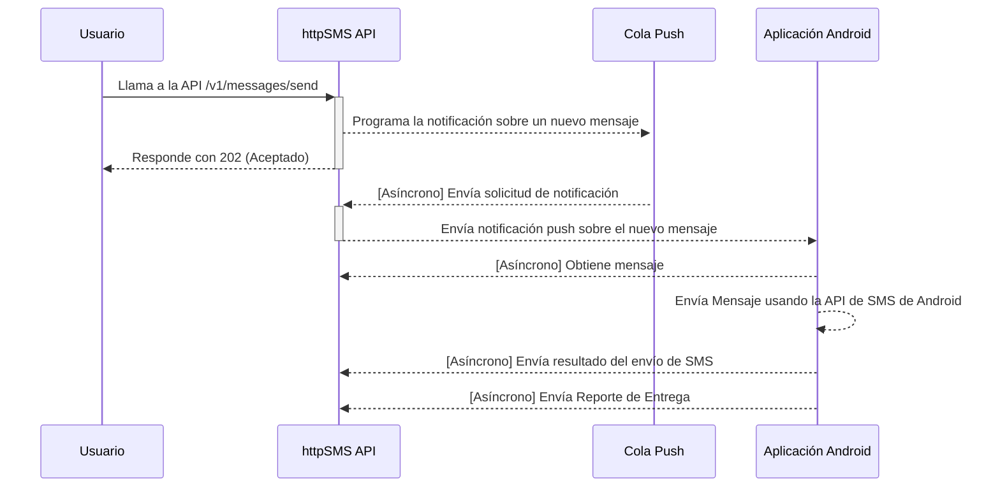

[](https://www.greptile.com/?utm_source=oss_badge&utm_medium=readme&utm_campaign=greptile_for_open_source)
[](https://github.com/sponsors/ndolestudio)
[](https://discord.gg/kGk8HVqeEZ)

*🌎 [Read in English](README.md)*

[httpSMS](https://httpsms.com) es un servicio que te permite usar tu teléfono Android como un Gateway de SMS para enviar y recibir mensajes SMS.
Realizas una solicitud a una API HTTP simple y esto activa tu teléfono Android para enviar un SMS. Los mensajes SMS recibidos en tu teléfono android también pueden ser reenviados a tu endpoint de webhook.

Guía de Inicio Rápido: [https://docs.httpsms.com](https://docs.httpsms.com)


## Tabla de Contenidos

- [¿Por qué?](#por-qué)
- [Interfaz Web](#interfaz-web)
- [API](#api)
- [Aplicación Android](#aplicación-android)
- [Chat/foro](#chatforo)
- [Características](#características)
  - [Cifrado de extremo a extremo](#cifrado-de-extremo-a-extremo)
  - [Webhook](#webhook)
  - [Presión de retroceso (Back Pressure)](#presión-de-retroceso-back-pressure)
  - [Expiración de Mensajes](#expiración-de-mensajes)
- [Clientes API](#clientes-api)
- [Flujos](#flujos)
  - [Enviando un Mensaje SMS](#enviando-un-mensaje-sms)
- [Configuración de Auto-Alojamiento - Docker](#configuración-de-auto-alojamiento---docker)
- [Pruebas de Integración](#pruebas-de-integración)
- [Licencia](#licencia)

## ¿Por qué?

Soy originario de Camerún y quería una forma automatizada de enviar y recibir mensajes SMS utilizando una API.
Desafortunadamente, muchos países no soportan la capacidad de comprar números de teléfono virtuales, y no pude encontrar una buena solución lista para usar que me ayudara a enviar/recibir mensajes SMS usando un teléfono móvil utilizando una API http intuitiva.

## Interfaz Web

La interfaz web https://httpsms.com está construida utilizando [Nuxt](https://nuxtjs.org/) y [Vuetify](https://vuetifyjs.com/en/).
Está alojada como una aplicación de una sola página (SPA) en firebase. El código fuente está en el directorio [web](./web).

## API

La API https://api.httpsms.com está construida utilizando [Fiber](https://gofiber.io/), Go y [CockroachDB](https://www.cockroachlabs.com/) para la base de datos.
Se ejecuta como una aplicación serverless en Google Cloud Run. La documentación de la API se puede encontrar aquí https://api.httpsms.com/index.html

```go
// Enviando un Mensaje SMS usando Go
client := htpsms.New(htpsms.WithAPIKey(/* Clave API de https://httpsms.com/settings */))

client.Messages.Send(context.Background(), &httpsms.MessageSendParams{
    Content: "Este es un mensaje de texto de prueba",
    From:    "+18005550199",
    To:      "+18005550100",
})
```

## Aplicación Android

[La Aplicación Android](https://apk.httpsms.com/HttpSms.apk) es una aplicación nativa construida utilizando Kotlin con principios de material design.
Esta aplicación debe estar instalada en un teléfono Android antes de que puedas comenzar a enviar y recibir mensajes SMS.

[](https://github.com/NdoleStudio/httpsms/releases/)

## Chat/foro

Hay varias formas de ponerte en contacto conmigo y/o con el resto de la comunidad. Siéntete libre de usar cualquiera de estos métodos. El que mejor funcione para ti:

- [Servidor de Discord](https://discord.gg/kGk8HVqeEZ) - chat directo con la comunidad
- [Problemas en GitHub (Issues)](https://github.com/NdoleStudio/httpsms/issues) - preguntas, características, errores

## Características

### Cifrado de extremo a extremo

Puedes cifrar tus mensajes de extremo a extremo utilizando el algoritmo [Cifrado AES-256](https://en.wikipedia.org/wiki/Advanced_Encryption_Standard) de grado militar. Tu clave de cifrado se almacena únicamente en tu teléfono móvil, por lo que incluso el servidor no tendrá forma de ver el contenido de tus mensajes SMS que se envían y reciben en tu teléfono Android.

### Webhook

Si quieres construir integraciones avanzadas, soportamos webhooks. La plataforma httpSMS puede reenviar mensajes SMS recibidos en el teléfono android a tu servidor utilizando una URL de callback que tú proporcionas.

### Presión de retroceso (Back Pressure)

Para no abusar de la API de SMS en android, puedes establecer un límite de tasa, por ejemplo 3 mensajes por minuto. De tal forma que incluso si llamas a la API para enviar mensajes a 100 personas, sólo enviará los mensajes a un ritmo de 3 mensajes por minuto.

### Expiración de Mensajes

A veces ocurre que el teléfono no recibe la notificación push a tiempo y no puede enviar el mensaje SMS. Es posible establecer un tiempo de espera durante el cual un mensaje es válido y si un mensaje expira después de que transcurra el tiempo de espera, serás notificado.

## Clientes API

- [x] Go: https://github.com/NdoleStudio/httpsms-go
- [x] JavaScript/TypeScript: https://github.com/NdoleStudio/httpsms-node

## Flujos

### Enviando un Mensaje SMS



## Configuración de Auto-Alojamiento - Docker

La aplicación se distribuye como imágenes de Docker y se puede ejecutar en cualquier host con Docker Engine o desplegarse en plataformas como Coolify, Portainer, CapRover, y Docker Swarm.

La documentación completa de auto-alojamiento está organizada en el directorio [`docs/`](./docs):

| Documento | Descripción |
|---|---|
| [docs/self-hosting_ES.md](./docs/self-hosting_ES.md) | Guía completa de configuración paso a paso |
| [docs/environment-variables_ES.md](./docs/environment-variables_ES.md) | Referencia para todas las variables de entorno |
| [docs/deployment-platforms_ES.md](./docs/deployment-platforms_ES.md) | Instrucciones específicas de plataforma (Coolify, Portainer, CapRover, Swarm) |
| [docs/docker-configuration_ES.md](./docs/docker-configuration_ES.md) | Referencia técnica de Dockerfile y docker-compose.yml |

### Inicio Rápido (desarrollo local)

```bash
git clone https://github.com/NdoleStudio/httpsms.git
cd httpsms
cp .env.example .env
# Edita .env con tus credenciales de Firebase, SMTP y Cloudflare Turnstile
docker compose up --build
```

La API ejecuta automáticamente migraciones de base de datos en el primer arranque. El usuario de sistema interno requerido por la cola de eventos también se crea automáticamente en el primer arranque. Revisa los registros del servicio `api` para ver las credenciales generadas si `EVENTS_QUEUE_USER_ID` y `EVENTS_QUEUE_USER_API_KEY` no se establecieron antes de iniciar.

Cuando el stack se esté ejecutando:

- Interfaz Web: http://localhost:3000
- API: http://localhost:8000
- Swagger UI: http://localhost:8000/index.html

Para instrucciones detalladas de configuración incluyendo la configuración de Firebase, configuración SMTP y pasos de construcción de la aplicación Android, consulta [docs/self-hosting_ES.md](./docs/self-hosting_ES.md).

## Pruebas de Integración

El proyecto incluye pruebas de integración de extremo a extremo que validan el ciclo de vida completo de envío/recepción de SMS. Las pruebas ejecutan todo el stack (API, PostgreSQL, Redis) en Docker junto con un emulador de teléfono que simula un dispositivo Android.

Documentación completa: [`tests/README.md`](tests/README.md)

**Ejecución rápida:**

```bash
cd tests
bash generate-firebase-credentials.sh
export FIREBASE_CREDENTIALS=$(jq -c . firebase-credentials.json)
docker compose up -d --build --wait
docker compose wait seed && sleep 2
go test -v -timeout 120s ./...
docker compose down -v
```

Las pruebas de integración también se ejecutan automáticamente en CI en cada push/PR a `main`.

## Licencia

Este proyecto está licenciado bajo la licencia GNU AFFERO GENERAL PUBLIC LICENSE Versión 3 - consulta el archivo [LICENSE](LICENSE) para más detalles
